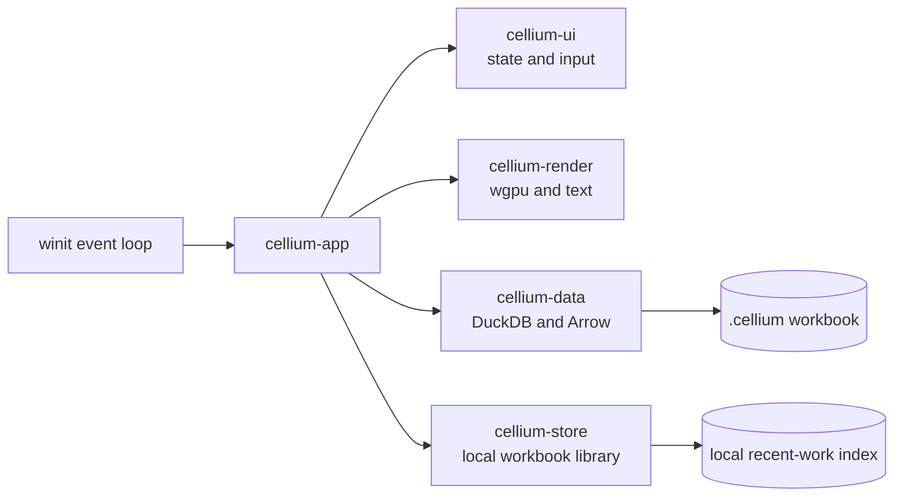

<div align="center">

# Cellium

### A fast, local-first spreadsheet for very large tabular files.

Open a CSV, Parquet, Arrow IPC file, or Cellium workbook and work in a responsive GPU-rendered grid without loading the whole dataset into the interface.

<p>
  
  
  
  
</p>

</div>

Cellium is a desktop spreadsheet UI over a local analytical database. It is designed for the moment when a normal spreadsheet becomes uncomfortable: large CSVs, wide tables, quick inspection, lightweight edits, and repeatable local work.

## What Works

| Area | Current capability |
| --- | --- |
| **Open and import** | CSV, Parquet, Arrow IPC, and `.cellium` workbooks |
| **Large-file workflow** | Immediate lazy preview followed by background materialization |
| **Grid** | Virtualized rows and columns, visible-window queries, overscan, frozen headers, and stable row identity |
| **Navigation** | Mouse wheel, pixel-precise touchpad scrolling, scrollbar dragging, middle-button panning, and inertial motion |
| **Selection** | Cells, ranges, whole rows, whole columns, select-all, additive selection, and drag auto-scroll |
| **Editing** | Single-cell editing, in-place text editing, mouse text selection, double/triple click selection, caret movement, delete/backspace, clipboard, and editor undo/redo |
| **Table views** | Quick sort, multi-column sort with Shift, filter-to-selected-value, clear view, exact filtered counts, and stable row IDs for edits |
| **Layout** | Table-only zoom, per-column widths, per-row heights, resize animation, and a monospace-first visual system |
| **Workspace** | Dark home screen, recent workbooks, starred workbooks, local search, new blank workbook, and file opening in a separate window |
| **Persistence** | Workbook metadata, imported tables, sparse cells, edits, and saved table views persist in the `.cellium` file |

## The Important Mental Model

Cellium keeps two kinds of work separate:

- **Imported source files** remain read-only. Cellium previews them as dense, queryable tables; once a copy is materialized into a workbook, edits target a stable row ID and column, so sorting or filtering cannot silently edit the wrong record.
- **Spreadsheet edits** live in a sparse workbook layer. A blank sheet does not allocate thousands of empty rows or columns.

The original CSV or Parquet file is never rewritten. Cell edits are saved to the local `.cellium` workbook that Cellium creates for the session.

## Fast Path For A Large CSV

```text
open file
   -> show a lazy visible window
   -> query only the rows and columns on screen
   -> materialize the workbook in the background
   -> switch to the durable table when ready
```

The UI event loop stays responsive while DuckDB performs blocking file work on a worker thread. Arrow record batches are used as the boundary between queries and the renderer; the grid retains only the window it needs plus a small prefetch margin.

## Run It

### Requirements

- Rust stable with Cargo
- A desktop platform supported by `winit` and `wgpu`

### Start Cellium

```bash
cargo run --release
```

Open a file directly:

```bash
cargo run --release -- /path/to/data.csv
```

You can also use the **Open** action or drop a supported file onto a running Cellium window.

### Verify The Workspace

```bash
cargo fmt --all --check
cargo check --workspace --all-targets --all-features
cargo clippy --workspace --all-targets --all-features -- -D warnings
cargo test --workspace --all-features
```

## Interaction Notes

| Action | Input |
| --- | --- |
| Start editing a selected cell | `Enter`, `F2`, or type |
| Commit and move | `Enter` / `Tab` |
| Cancel editing | `Escape` |
| Select all text in a cell | `Cmd/Ctrl + A` while editing |
| Undo / redo text edits | `Cmd/Ctrl + Z`, `Cmd/Ctrl + Shift + Z`, or `Cmd/Ctrl + Y` |
| Copy / cut / paste | `Cmd/Ctrl + C/X/V` while editing |
| Move the active cell | Arrow keys |
| Extend a selection | `Shift` + click or arrow key |
| Zoom the table | Pinch on a touchpad, or `Cmd/Ctrl` + wheel; `+`, `-`, and `0` also work |
| Pan the canvas | Middle-button drag |

## Architecture



The workspace is split so the hot path stays obvious:

```text
crates/
├── cellium-app       desktop entrypoint and event orchestration
├── cellium-core      workbook model, IDs, commands, and history
├── cellium-data      DuckDB import, queries, Arrow windows, and persistence
├── cellium-formula   formula AST, parser, evaluator, and dependencies
├── cellium-render     retained wgpu renderer and text pipeline
├── cellium-search     fuzzy and indexed search building blocks
├── cellium-store      local workbook-library repository
└── cellium-ui         input state, grid math, and reusable UI components
```

The renderer is retained-mode and viewport-driven: it does not create a UI object for every cell, query from a draw call, or load an entire table into RAM just to display it.

## Workbook Files

Cellium workbooks use the `.cellium` extension and are DuckDB-backed files. On macOS, new blank workbooks are created under:

```text
~/Library/Application Support/Cellium/workbooks/
```

Imported source files remain where they are. The workbook stores the imported table, workbook metadata, sparse edits, and view state locally.

## Project Status

Cellium is an early alpha and is being built around a deliberately narrow core: local files, fast inspection, spreadsheet-like selection and editing, and durable local workbooks. Cloud connections, collaboration, charts, pivots, and full Excel compatibility are intentionally not part of the current product surface.

The codebase is organized as a Cargo workspace so those features can be added without turning the renderer, data engine, and workbook model into one coupled module.

## License

The workspace metadata declares dual MIT/Apache-2.0 licensing. A finalized license file will be added before the first public release.
